# awesome-MovieQA
关于近几年顶会顶刊Movie有关的工作

我个人觉得本质上来讲很多都是interaction，而不一定是relationship。

## 1.CVPR2020@Learning Interactions and Relationships between Movie Characters
这篇文章就是指出关系有的从视觉从可以推断，有的从dialog中推断，有的需要两者的fusion才可以得到。

很多关系都是bottom-up的，而不是parent那种top-down的。
其中interaction以及relationship都是分开讨论的，interaction表示action，然后relationship就是表示关系～我们必须同时建模才可以理解。（因为关系也改变的）


### Motivation:这里就是探索两个问题
1.can learning to jointly predict relationships and interactions help improve the performance of both?
2.can we use interaction and relationship labels at the clip or movie level and learn to identify the pair of characters involved?

### 关于问题2的核心就是将其当作是一个weak track prediction.这里就是使用label，我们能否找到pair of characters呢？


## Dual Hierarchical Temporal Convolutional Network with QA-Aware Dynamic Normalization for Video Story Question Answering@MM20
### Motviation:
1.先前的注意力网络很热火，但是他们的工作忽视了一些重点:只是考虑single temporal scale。这个就是会忽视可能一些相关的segments of videos/subtitle sequences会表示成不同的temporal scales for different samples。@@temporal granularities。

2.目前的多模态交互都是多个vector直接fuse，而忽视了那种dynamic and finegrained interactions between each word and each video feature unit。

3.先前的方法并没有fully探索QA pairs的信息。shallow exploitation of question and answer choices。


### MovieQA比起VideoQA的挑战
1）视频包含了更多的diverse information，比如背景噪声/flow of actions/所以特征空间更大而且更加复杂@比起text或者image而言。

2）多个异质的模态，比如video and subtitle。

3）video和subtitle sequences往往是非常长的，定位相关的segment是十分困难的事情。

### 1. Input Embedding
video feature就是resnet152extract，然后对于每个video@3 fps的feature进行L2 Norm，然后project into 512D。当然我们也用detected object labels而不是图像特征来作为输入。

对于textual input，比如subtitle和QA pairs，就是BERT来encode。然后Q和A进行concatenate。

### 2.多模态Alignment&Temporal Modeling
就是multihead(normalize)+BILSTM来进行融合啦。～～～套路比较多。x,y,x.y

### 3.QA-Aware Dynamic Normalization


## Bilinear Graph Networks for VQA
这篇文章尝试分析了Bilinear attention network以一个graph perspective。
### 1. Abstract
1.传统的Bilinear Attention network呢就是缺少探索细致的relationship between words for复杂的推理。

2.我们使用了两个graph相互配合～

### 2。Introduction——Novelty
1.这里主要challenge的是两篇文章BAN的话提到以前的monolithic方法忽视了words之间的interaction，以及object之间的interaction。所以就提出了一个bilinear co-attention mao考虑到每个模态内部的pair。

2.第二篇文章就是DFAF和MCAN这两篇，主要就是建模了内部的attention，外部的attention以及scaled dot-product attention～

3.但是BAN缺乏了全面的探索interactions between words in questions@@建模这个context。linear@attention就是很难表达好这种relationship～

## 1.Bilinear Attention Networks@ 2018
### Motivation
1.Co-attention这种方法就是忽视了interaction between words and visual regions，这些其实是可以帮助我们避免增加太多的计算复杂性的。

2.这里就是说我们的single attention distribution其实可以被更好利用，比如一个question中包含了多个visual concepts@由多个words进行表达的，那么使用visual 注意力distribution for each word可以探索更多的相关信息。

## 1.Relation-Aware Graph Attention Network for VQA
### 1.Motivation
1.就是找了一下VQA的一个问题，上面说到为了真正理解image对应的问题，我们必须能够识别不仅是objects，还有对应的环境grass，以及actions-eating，还有locations-at the far right。

2.可能存在的solution就是包括两个1.探索对应的geometric positions的关系-可以表示location～2.semantic dependencies-就是可以表示action。

### 2.对自己方法的描述
我们的方法就是可以reveal more fine-grained visual concepts in the image，这个就是可以in turn provides a holistic scene description。

然后in turn 提供了一个holistic scene interpretation@@可以来回答语义非常复杂的问题。。

为了能够回答这些非常high variance的问题，我们同事学习了explicit relations以及对应的implicit relations。
### 3.我们方法的简介
这里就是为了全部理解VQA中的visual scene，尤其是不同的objects之间的interactive dynamics，我们这里就是提出一个Relation-aware GAT(ReGAT)来建模这种multi-type inter-object relations via a GAT.

1.一种是explicit relations:就是geometric positions和semantic interactions。@和之前使用GCN的方法不一样，我们的GAT allows for assigning 不同的重要性@nodes of the same neighborhood。

2.一种是implicit relations:就是capture the hidden dynamics between image regions。@这里就是graph that is adaptive to each question by过滤掉question-无关的relations。

俄案后我们呢就是将question信息也引入GAT的学习过程，这个的好处就是dynamically focus on particular relation types and instances for each question on the fly。

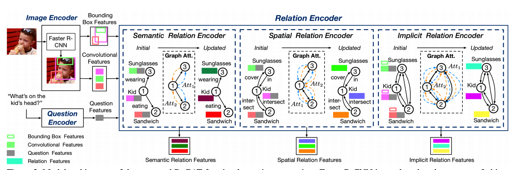

### Image Encoder
这里就是Faster-RCNN就是36个object，2048d的视觉特征以及对应的4d的bbx特征。

### Question Encoder
这里就是BIGRU+self-attn作为最后的question encoder@1024d。

### Graph Construction
#### 1.全连接Relation Graph@implicit relation encoder
这里就是所有的权重都是learned implicit 而没有任何的prior 知识。
#### 2.Pruned Graph with Prior 知识
sparse。可能就是需要这种spatial graph

1.spatial graph:
这里就是从边的角度上来说是对称的，但是predicate就会产生变化。

2.semantic graph:
这里就是一个semantic relation分类器 on a visual relationship dataset（Visual Genome）。这时的edge不再是symmetric的了。man holding bat okay，但是相反没啦。（没有引入被动）

这个relation classifier很简单的，就是将object和subject对应的OD的vector就是先各自transform一下，然后就是通过concate在一起并且fed进分类器去分类这13+1种class，其中这个1是no-relation。

### 3.Relation Encoder(不同的问题需要不同的relations）
1.总Question-adaptive Graph Attention（对于不同的relation graph我们使用不同的注意力系数的定义，以及改变对应的projection matrix。）
```
这个引入就是不同的问题可能需要不同的relations，所以我们所做的事情就是给那些与问题最相关的relations更大的权重，
1). 首先将question和每个visual vector都进行concatenate，
2). 然后就是self-attention来更新啦，对于不同的relation graph我们使用不同的注意力系数的定义，以及改变对应的projection matrix。
```


2.分Implicit Relation:
```
这里我们的设计weight，不仅依赖于visual-feature weight，而且依赖于bbx weight。

```


3.分Explicit Relation
1）semantic relation encoder
因为这里有labels+directions，所以我们这里有注意仔细设计，对于方向的敏感性。


### 训练就是
将每个最后的visual和q进行combine predict，然后就是我们的三个GAT都是独立训练的，然后最后我们就是使用加权融合分数。

### 实验结果
这里就是每一种relation都是有意义的，然后最后的结果证明这种graph之前就进行了combine query的也是可以improve结果的，这个可以当作是Q-adaptive.


## 1.Adaptive Graph Representation Learning for Video Person Re-identification@2019TIP
Person Re-id 就是目的是从gallery里面使用一个person of interest作为输入的query，然后准确检索对应的identities。
### 1.现有方法的工作:
1.许多existing methods就是首先frame-level的feature，然后video-level的feature则是通过temporal aggregation来进行产生的。然后将它们放在一个particular metric space里进行对比。

2.尽管深度学习取得了很多成功，但是事实上occlusion/viewpoints/illumination/pose variation在video中的问题还是很显著的。
为了解决这个问题，现有的方法就是使用image region-attention来获取feature。**但是这类方法往往不能处理好那种有特殊情况的场景，比如occlusion/pose variations的场景，intrinsic relations between person parts across frames。而这个在robust video表达上还是比较有意义的。
*比如，如果body parts在第一个frame里是occluded的，那么appearance cues and contextual information就是比较有意义的@complementary。*
因此，如果自适应表现关系建模以及上下文信息的传播among spatial regions是一个关键的issue。**

### 因此我们的工作
1.我们创建两个relations named pose alignment connection以及对应的feature affinity relation。@时空regions。

1）pose alignment connection: 这里就是across frames的spatial regions@包含相同身体部分的就align在一起了。

2）feature affinity connection: 这些特征的相关性。（visually semantic relationships）

2.这就是上面的两个graph根据GNN建模，就会将regional feature的informative增强，noise减少啦。

3.同时对于长视频而言，可能只有部分关键frame就可以代表所有的视频信息了.(consistency among different temporal resolutions).


# BiST: Bi-directional Spatio-Temporal Reasoning for Video-Grounded Dialogues@2020EMNLP，适合我的第三份工作@hop=1，很奇怪
Video-grounded Dialogues是非常有挑战性的，因为:

1) complexity of videos contain both spatial and temporal variations(时间和空间上的变化);

2) complexity of user utterances用户的言论which query different segments and/or different objects in videos over multiple dialogue turns~

## Motivation:
1.现有的网络仅仅专注于superficial temporal-level visual cues,但是忽略了更finegrained的spatial signals～（不仅探索了both spatial and temporal-level的信息，而且learn dynamic information diffusion扩散 between the two feature spaces通过spatial-to-temporal和temporal-to-spatial推理～）

**我们的策略就是bidirectional的@tackle the evolving semantics of user queries in the dialogue setting～**

## Large Margin over TGIF-QA SOTA

## Introduction说的Motivation
1.“where to look”+“when to look”这里就是spatial reasoning+temporal reasoning～

2.但是现在的很多方法仅仅是忽视了spatial features并且假设each spatial region对于current task而言是同等重要的（uniform weight）。这种方法呢就比较适合video involves 少量的objects以及spatial positions can be treated similarly～**但是，事实上许多scenario，each video frame包含了多个distinct objects然后并不是所有的他们都和question有关～**

3.那么我们的工作很大部分上就受到了一些关于时空推理的工作的影响～

## 不过现有的工作的有这样的缺陷
比起专注于处理空间输入然后处理temporal inputs~我们就是注意到in some cases，更实际的是首先识别相关的video segments在定位到specific subjects of interest之前。那么考虑到问题in a dialogue setting，问题很可能是和varying temporal locations of the video有关而不是仅仅small fixed segment～（那么我们这里就是探索了一个双向的vision-language reasoning）

## 我们的这个双流推理结构的核心优势
1.spatial-temporal reasoning就是更加适合human queries related to specific entities或者有关多个objects的视频～

2.temporal-spatial reasoning就是更加适合human queries about a particular video segment或者videos of extensive lengths～

## 可以精读本文中所涵盖的Spatio-Temporal Learning有关的～

## 关于本文的BiST Model
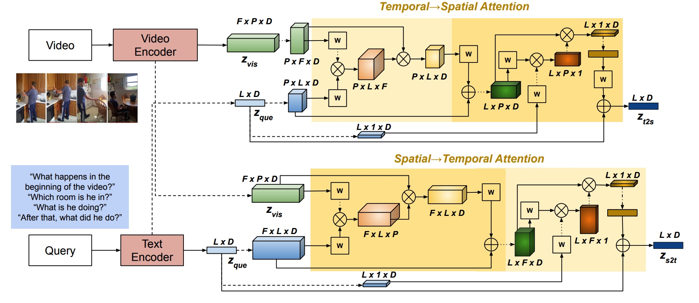

### 1.关于Problem Formulation
这里就是输入包括当前的Video，t-1 turns的dialogue（按照human utterance H+dialogue agent response A来进行排列组合）(H1,A1,...,H_(t-1),A_(t-1))以及当前的human utterance H_t.

输入的视频包括features in不同的模态，包括视觉，audio以及text（比如caption或者subtitle）
### 3.1.1 Text Encoders（自己训练）
positional encoding+token-level embedding@element-wise summation+layer norm

这里就是针对dialogue history/user query/video caption/target response～

### 3.1.2 Video Encoder（这里就是fixed直接extract）
1.这里就是我们还是clip extraction，获得的3D-CNN的feature将其+linear-ReLU+layer norm-》减少feature dimension～

2.audio feature这里就是follow similar procedure@Fxd。

### 3.2. Bi-directional Reasoning
#### 3.2.1. Temporal-》Spatial
1.这里的第一个步骤就是针对3D CNN获得的每个spatial region上的特征～（进行一个weighted sum）

2.这里就是query对temporal上的softmax weighted sum～+FC+ReLU。
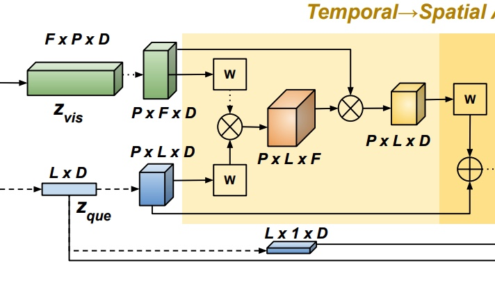
这个图片就是关于Temporally Attended Features。
这里就是最后将其和language feature进行skip connection～@Z_(t2s)^t.

3.然后就是user query又一次应用起来去搞这个dependencies along the spatial dimension～
这里还是一样的softmax weighted sum，那么看起来这次就有了不一样的套路啦～

#### 3.2.2. Spatial-》Temporal
这里的操作还是一样的～

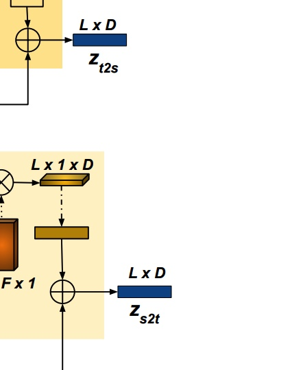
这里就是final reasoning对应的特征

#### 对自己framework的总结
1.这里就是咱们的这个是allow neural models to diffuse information from these feature spaces in两个不同的方式～

2.那么我们的方法就是local and global signals，我们的方法就是使得global-to-local 以及local-to-global来获取diffusion of visual cues in video～

#### 3.3. Multimodal Reasoning
相似的，我们还考虑了language-audio reasoning/language-language reasoning。（相似的计算流程）

#### 3.4. Multimodal Fusion
就是获得了这些attended features之后，我们combine这些query-guided video representation～@（合并information from 所有的模态～）

这里就是question-guided feature fusion，如果audio features不重要，那么就不会参与问题～

### TGIF-QA Results
这里就是我们的模型使用ResNeXt3D的结果表现比ResNet要好，我想这里的一个很主要的原因就是sequence-level feature is more consistent than frame-level feature。

## Impact of Spatio-temporal Learning
这里的实验结果就是temporal-spatial learning的效果比spatio-temporal learning的好～这个可能就是multi-turn setting，each turn都关于不同的relevant video segment，以及我们的video一般会比较长～


# Where Does It Exist: Spatio-Temporal Video Grounding for Multi-Form Sentences
localize the spatio-temporal tube of the queried object.
## 这个任务的难点:
1.我们需要从untrimmed videos中进行定位，这个object可能仅仅在small segments中～

2.我们需要处理multi-form sentences，比如declarative sentences with explicit objects+interrogative sentences with unknown objects

## Motivation
1.现有的STVG task不能好好建模因为tube pre-generation做的不好+缺乏object relationship modeling～

## 我们的Contributions
1.我们这里就是spatio-temporal region graph@capture region关系 with temporal object dynamics～
**这个graph包括了implicit spatial graph and explicit spatial graph in each frame还有temporal dynamic subgraph across frames～**
*我们这里就是将textual clues into the graph～*

2.我们介绍了一个spatio-temporal localizer@dynamic选择to directly 检索spatio-temporal tubes without tube pre-generation。

## 现有的工作的缺陷
1.existing video grounding方法often extract a set of时空tubes from trimmed videos然后识别target tube that matches the sentence～（但是这个框架不适合STVG，因为这方法很看重咱们pre-generate的tube candidates的quality～**existing pre-generation framework can only produce complete object tubes from trimmed videos**

2.其他，这些方法仅仅考虑single tube modeling以及忽视了objects的关系～**尤其是interrogative sentences that may only offer the interactions of the unknown objects with other objects～**

## 我们的方法
**我们提出的是Spatio-Temporal Graph Reasoning Network(STGRN)捕捉temporal object dynamics + 直接定位时空tubes without tube pregeneration～**

1.我们将视频解析成a spatio-temporal region graph。（以前的工作visual graph仅仅建模frame中的spatial graph，我们的则考虑了each frame中implicit and explicit spatial subgraph，但还考虑了temporal dynamic subgraph～

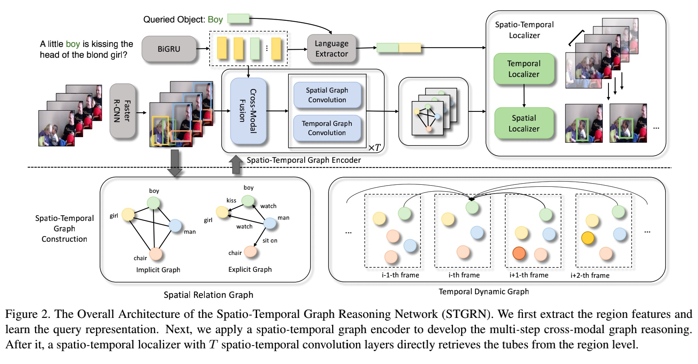

### 3.1. Video and Text Encoder
Faster-RCNN@each frame,(where a video contains N frames and the t-th frame corresponds to K regions~)@(+bbx features)~

question@bigru+entity attention(聚合邻居的信息～)

### 3.2. Spatio-Temporal Graph Encoder
1.这个就是每个frame都有两种graph，包括implicit spatial subgraph以及explicit spatial subgraph～@each frame～

2.然后还有一个temporal dynamic subgraph across frames～

这三种graph的vertexes都是regions，然后有不同的边～（同时每个都有self-loop）

#### 3.2.1 Implicit Spatial Graph
unlabeled edges in each frame～@每个frame（全连接图）

#### 3.2.2 Explicit Spatial Graph
1.这里就是使用relation classifier来对这个进行分类～region i的特征是什么的，还有region j的feature以及两者union bbx的特征～

2.就是使用三个不同的linear将这些feature进行transform，然后concatenate一起分类层@predict the relations～**我们在classifier on the Visual Genome dataset训练了这个分类器，我们选择了top-50 frequent predicates in its training data然后增加一个extra no_relation class for non-existent edges~**(我们预测了relationship)

3.最后就是edges就是有3个directions，i-to-j,j-to-i,i-i.

#### 3.2.3 Temporal Dynamic Graph
temporal graph@capture the dynamics and transformation of objects across frames.所以我们就是需要connect the regions containing the same object@不同的frames。

**这里就是对于每个frame t，我们就是连接its regions with相邻的2M frames(M for forward frames and M for backward)**

我们的linking score计算的方式是这样的

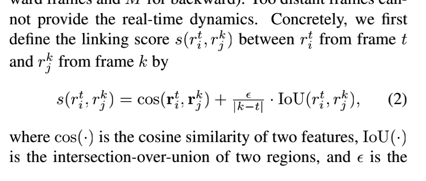

这里就是我们同时考虑appearance similarity and spatial overlap ratio of two regions，然后temporal dynamic distance用来limit the IoU score。那么对于distant frames，linking score主要就是根据feature similarity而决定的。

@@@Temporal Dynamic Graph就是三个edge（forward/backward/self-loop～）

2M+1 edge for each region～（**我们设置的M=5**）

## 3.3. Multi-step Cross-Modal Graph Reasoning
### 3.3.1 Cross-Modal Fusion
这里就是为了capture the relationships associate with the sentence，我们首先使用一个cross-modal fusion@动态将textual evidences 映射到spatio-temporal graph～

1.我们这里就是针对每个visual region对sentence的每个word进行attention计算。然后weighted sum～

我们就是使用一个textual gate+question两者拼接在一起表示（filtered region feature and textual feature 去obtain the cross-modal region features）这个学习的每个node的question表达则是基于BiLSTm的结果～


### 3.3.2 Spatial Graph Convolution
**Implicit Graph Convolution**
这里就是和GAT有些相似，但是这里采取的是特征相似性进行attn～


**Explicit Graph Convolution**
不同于原来的undirected GCN，我们这里就是考虑了direction和label information of edges～

这个边就是relation，所以我们的edge就是单纯由question进行softmax@51个类～
然后就是根据有向图的方式更新node feature～

### 3.3.3 Temporal Graph Convolution（无方向性）
这里就是我们develop the temporal 图卷积 on the directed and unlabeled graph。
这里和implicit graph一样的计算方式～特征相似性的attn～

### 3.3.4 combine这些卷积
sum然后ReLU～

（这里的融合是针对每个align的进行融合的）

## 3.4. Spatio-Temporal Localizer
我们设计一个spatio-temporal localizer to determine the temporal tube边界以及spatio-temporal tubes of objects from the region label～

**Temporal Localizer**: 
这个就是estimate a set of candidate clips and调整他们的boundary to obtain the temporal grounding～

1.first aggregate the relation-aware region graph@frame level by 注意力机制～
2.with the query表达，region features of each frame are attended by:


```
1.首先我们获得关系aware的region graph into the frame level@@注意力机制～

2.这里就是获得对于每个frame的feature@guided by our query～
```
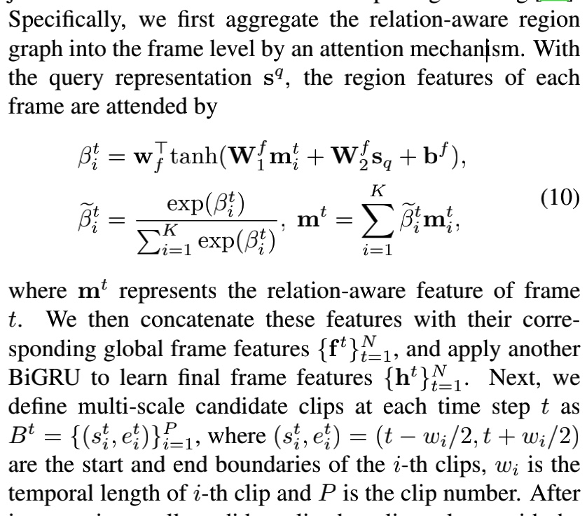

这里就是我们获得relation-aware feature of frame t。我们然后将其concatenate with 他们的corresponding global frame拼接在一起然后通过一个BiGRU获得final frame feature～
**每个hidden state**

这个就是最后的针对每个query和visual region都计算一下loss～

# Learning Reasoning Paths over Semantic Graphs for Video-Grounded Dialogues
## Motivation:

# Temporal Relational Reasoning in Videos
我们这里就是提出一个有效而且interpretable 的网络模块，叫做Temporal Relation Module(sparsely sampled video frame可以取得很好的结果)
## Motivation:
1.

# Video Question Answering via Hierarchical Dual-Level Attention Network Learning@MM2017-可以学习表达如何同时搞image和video
## Motivation:
1.关键信息可能只是存在于一部分frames里，所以使用temporal attention是很常见的；

2。对于视频理解而言除了image的appearance还应该要motion对应的feature，所以需要同时利用segment-level的和image-level的。

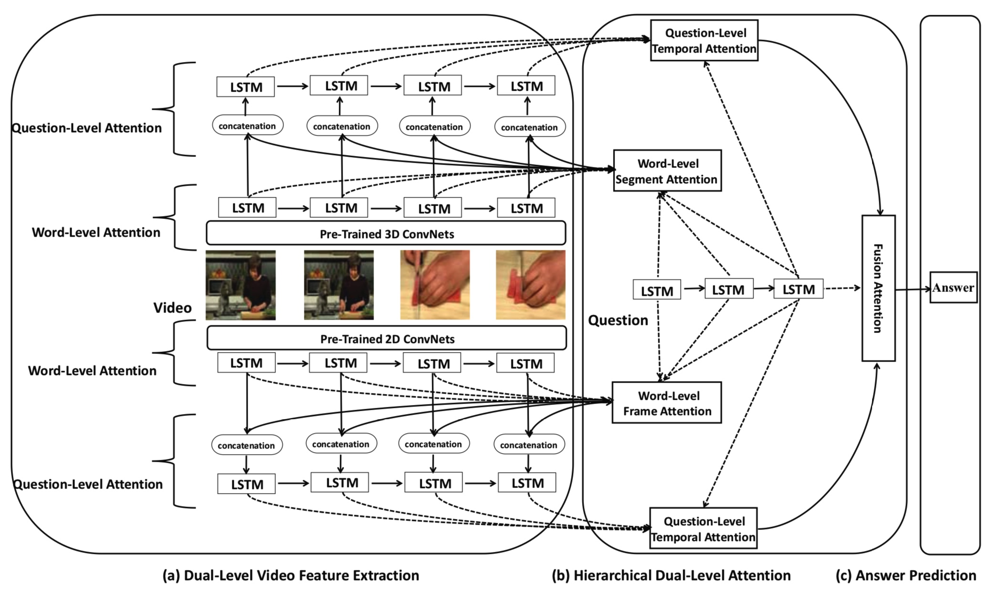


# 1.Dual Hierarchical Temporal Convolutional Network with QA-Aware Dynamic Normalization for Video Story QUestion Answrring
## 1.Motivation:
1.现有的方法有这么几个常见的defects:

1)single temporal scale;@就是不同的问题可能需要不同的temporal scales来搞呢。。。

2)static and rough multimodal interaction;

3)对于question和answer choices信息利用的不够充分～

2.我们的方法是怎么解决以上问题的呢？@Dual Hierarchical Temporal Convolutional Network(DHTCN)

1)多个temporal scales@建模层次化的时间卷积网络；

2)在每个时间卷积网络中，我们都有两个关键的模块，AttLSTM和QA-Aware Dynamic Normalization去捕捉这个temporal dependency以及multimodal interaction@（以一个动态和finegrained角度）

3）为了充分探索问题和答案有关的信息，我们这里就是增加了QA pairs的深度@通过一系列堆叠的非线性层～

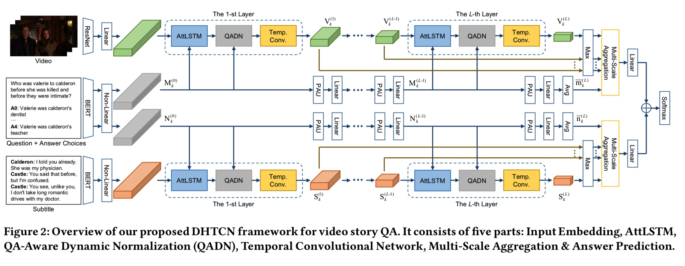

## encoder
这里的feature encoder很有趣的，visual feature就是ImageNet的3fps feature，textual feature就是Bert+一系列简单操作～

## 3.2. Multimodal Alignment + Temporal Modeling
这里就是使用Multihead Attn操作subtitle和video，然后就是BiLSTM来建模temporal dependency～

## 3.3. QA-aware Dyanmic Normalization

## 3.4。 时序卷机
这里就是直接获得多个level的，然后根据QA pairs获得attn-based embedding～

# 2.Video Dialog via Multi-Grained Convolutional Self-Attention Context Networks@MM19@Core
## Motivation
1.dialogue history一般都是用RNN来建模，可是事实上video和dialogue data都是十分variable的，因此我们认为RNN可能不是一个很好的选择～

2.视频中关于一些动作啊什么的都是使用的是dynamic attributes of video are usually included in several frame segments instead of a single frame.@(**所以原始的self-attention的方法仅仅考虑element-wise interaction不太现实**)

3.那么我们的设计就是同时考虑element and segment level interactions～@(**multi-grained sequence information**)

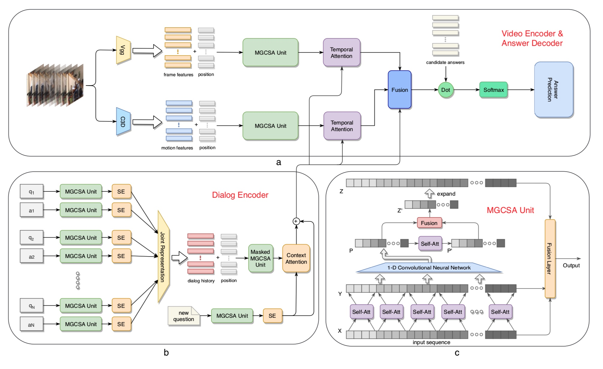

## 我们的方法
关于上述的3，就是层次性dialog history@(**context-aware question representation**), (**two-stream video encoder**)

## 1.Encoder
这里就是frame-level的frame feature；还有clip-level的motion feature～
还有就是dialog history的textual feature+answer对应的feature～

## 2.Multi-grained Convolutional Self-attention
这里就是接受word embedding对应的句子或者video frames作为输入，

1）首先是self-attn

2）然后就是使用segment-wise的1D卷积作为encoding@长度为segment对应的长度l@看作是原始的segment～得到的P作为local-interacted feature sequence

3）接着继续进行segment-wise的self-attn～

最后就是融合local-interacted和global-interacted的feature作为最后的结果～


接着就是三方面的特征进行融合。


## Experimentation
关于实验部分，我们这里的结果就是设计的这个单元很有效～

然后self-attn对应的结果的个数是一个超参数@我们有认真进行调节～

# *Core*
# Erasing-based Attention Learning for Visual Question Answering@MM19，改进attention注意力机制的一个策略，后期建议深刻学习
## Motivation:
1.我们就是attn和non-attn之间区分一下就好了@attn和non-attn parts分开的比较好～（而不是简单的attn）
2.这里就是结合咱们的loss学习more discriminative attention map～
3.并没有额外的参数，可以和任何attn model放在一起combine。

咱们这个soft attn事实上不是desired，这里就是说错误的原先的attn学习的应该注意的和不应该注意的距离应该增加一下。

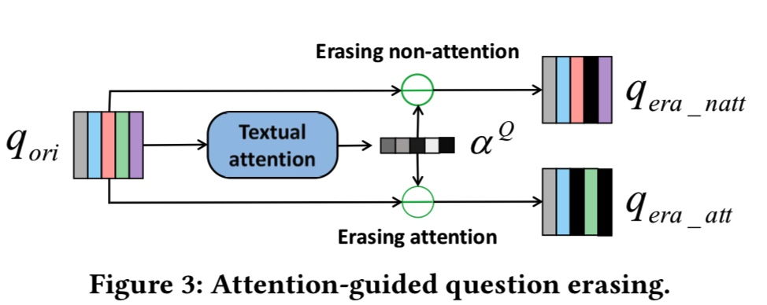

# Multi-interaction Network with Object Relation for Video Question Answering@MM19
## Motivation:
1.主要的工作就是尝试使用CNN或者RNN来capture spatial-temporal features+attn；
2.我们的这里就是做一个multi-interaction model，主要包括了两种interaction:

1)multi-modal interaction between the visual and textual information;

2)multi-level interaction inside the multi-modal interaction.@(**新的multi-interaction比起self-attn，我们可以同时建模element-wise和segment-WISE的特征interaction**)

**这里比起normal frame-level interaction，我们还考虑了object relation～**

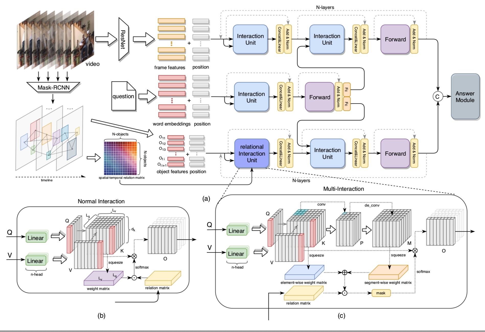


2.我们需要处理multi-form sentences，比如declarative sentences with explicit objects+interrogative sentences with unknown objects#¥
2.我们需要处理multi-form sentences，比如declarative sentences with explicit objects+interrogative sentences with unknown objects#
2.我们需要处理multi-form sentences，比如declarative sentences with explicit objects+interrogative sentences with unknown objects


